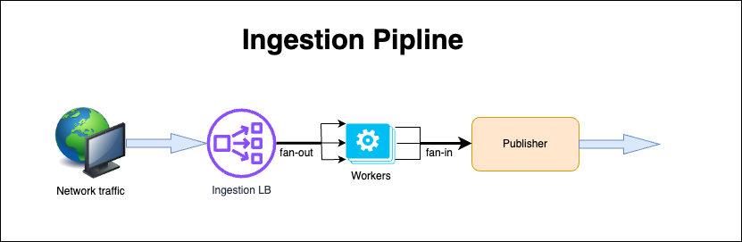

# go-by-example

A selective tour of Go by example, with emphasis on concurrent programming.

Concepts covered:
* Variable declaration/assignment
* Range looping
* Panic
* Defer
* Shared memory space signaling (work group, channel)
* Go-routines
  * https://go.dev/doc/faq#goroutines
  * https://dev.to/gophers/what-are-goroutines-and-how-are-they-scheduled-2nj3
  * https://granulate.io/blog/deep-dive-into-golang-performance (Threading Model section)

## Architecture
This code implements the following simulated data pipeline:



## Compiling
`go build -o app`

## Running
1. Start the server: `./app`
2. Make sure [netcat](https://netcat.sourceforge.net/) is installed
3. Send sample TCP packets:
   ```sh
   for ((x=0; x<10; x++)); do echo -e "$x" | netcat localhost 8080 -c && sleep 1; done
   ```
